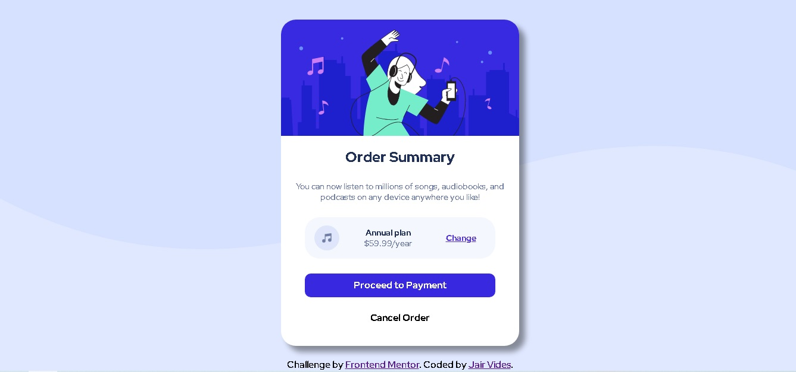

# Frontend Mentor - Order summary card solution

This is a solution to the [Order summary card challenge on Frontend Mentor](https://www.frontendmentor.io/challenges/order-summary-component-QlPmajDUj). Frontend Mentor challenges help you improve your coding skills by building realistic projects. 

## Table of contents

- [Overview](#overview)
  - [The challenge](#the-challenge)
  - [Screenshot](#screenshot)
  - [Links](#links)
- [My process](#my-process)
  - [Built with](#built-with)
  - [What I learned](#what-i-learned)
  - [Continued development](#continued-development)
  - [Useful resources](#useful-resources)
- [Author](#author)
- [Acknowledgments](#acknowledgments)

**Note: Delete this note and update the table of contents based on what sections you keep.**

## Overview

### The challenge

Users should be able to:

- See hover states for interactive elements

### Screenshot




### Links

- Solution URL: https://github.com/jairvides/Order-summary-component-challenge-hub

## My process

### Built with

- Semantic HTML5 markup
- CSS custom properties
- Flexbox
- CSS Grid

### What I learned

I learned flexbox in css, anything tags in html how <span> and how to do a responsive design.


```html
<span>You can now listen to millions of songs, audiobooks, and podcasts on any device anywhere you like!</span>
```
```css
.container {
    width: 400px;
    height: 550px;
    background-color: #fff;
    overflow: hidden;
    border-radius: 25px;
    box-shadow: 10px 10px 10px rgba(0, 0, 0, 0.4);
    display: flex;
    flex-direction: column;
    align-items: center;
    text-align: center;
}
```

### Continued development

I want to learn more about web applications every day, I am too passionate about programming and I hope to meet the challenges.

### Useful resources

- [Resource 1](https://www.youtube.com/watch?v=D--Lx1egIas&t=36s) - This helped me for knowlegde about frontendmentor.io. I really liked this pattern and will use it going forward.
- [Resource 2](https://codepen.io/szpakoli/pen/xbJjdR) - This helped me so much how to create a card.


## Author

- Website - [Jair Enrique Vides Berdugo](https://www.linkedin.com/in/jairvides/)
- Frontend Mentor - [@jairvides](https://www.frontendmentor.io/profile/jairvides)
- Twitter - [@yourusername](https://twitter.com/JAIRVIDES)


## Acknowledgments

Thanks to Dany.B for the information about frontendmentor and for the tutorial in youtube.
